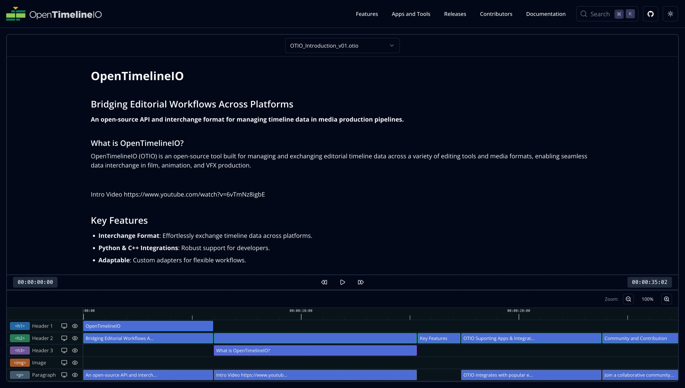
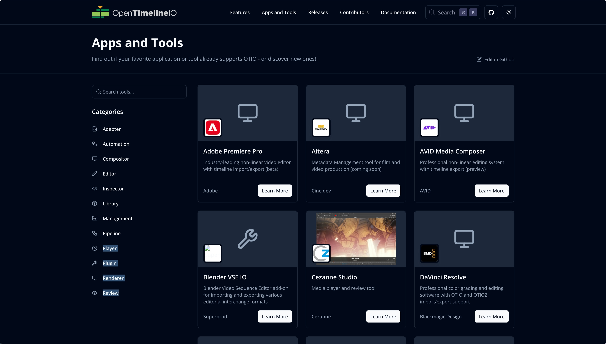
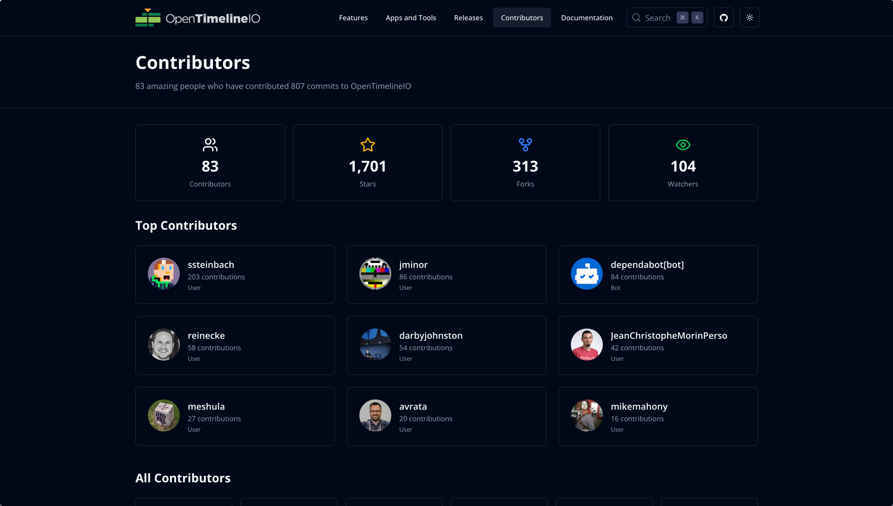
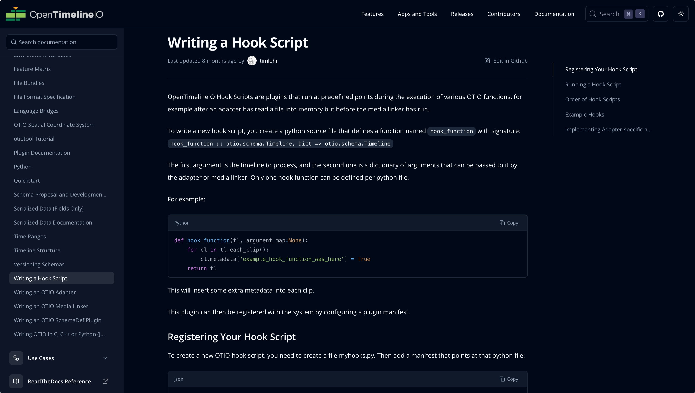
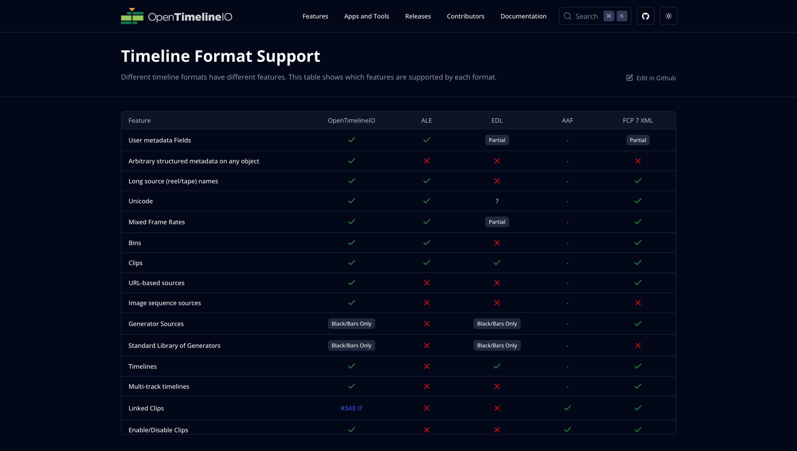
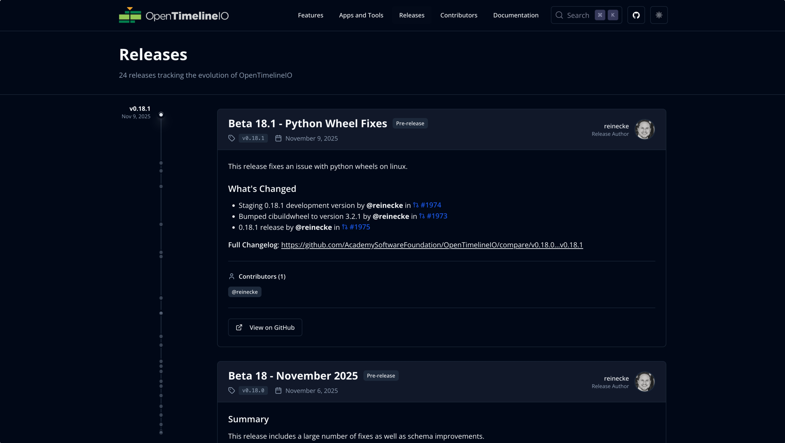
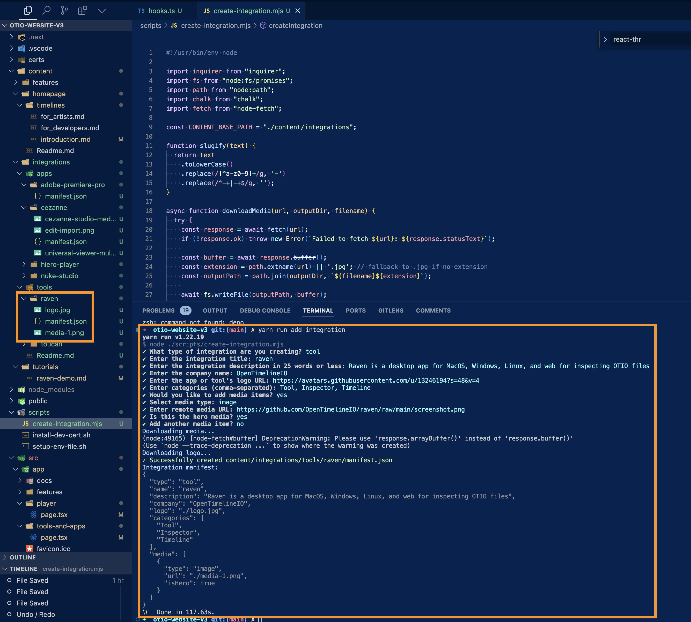

# OpenTimelineIO Website

A modern, performant website for OpenTimelineIO built with [Next.js 16](https://nextjs.org/). This project showcases the power of OTIO through interactive demos, comprehensive documentation, and real-world integrations.



## 📋 Table of Contents

- [Getting Started](#-getting-started)
- [Project Architecture](#-project-architecture)
- [Page Data Sources](#-page-data-sources)
  - [Homepage](#homepage-)
  - [Apps & Tools](#apps--tools-apps-and-tools)
  - [Contributors](#contributors-contributors)
  - [Documentation](#documentation-docs)
  - [Features](#features-features)
  - [Releases](#releases-releases)
- [Adding Integrations](#-adding-integrations)
- [Advanced Features](#-advanced-features)
  - [Interactive GitHub Preview Cards](#interactive-github-preview-cards)
- [Technology Stack](#-technology-stack)
- [Project Structure](#-project-structure)
- [Styling & Theming](#-styling--theming)
- [Content Management](#-content-management)
- [Deployment](#-deployment)
- [Contributing](#-contributing)
- [Resources](#-resources)

---

## 🚀 Getting Started

### Prerequisites
- Node.js >= 22.0.0
- Yarn package manager

### Installation

1. Install dependencies
```bash
yarn install
```

2. Setup HTTPS certificates (required for WASM features)
```bash
yarn dev:setup
```

3. Start the development server in HTTPS mode
```bash
yarn dev:https
```

Open [https://localhost:443](https://localhost:443) with your browser to see the result.

> **Note:** HTTPS mode is required for the WASM build of Raven (the interactive timeline player) to work properly due to `SharedArrayBuffer` requirements.

---

## 📊 Project Architecture

### Next.js 16 Features

This project leverages several cutting-edge Next.js 16 features:

#### **React Server Components & Server Actions**
- All pages use Server Components by default for optimal performance
- Data fetching happens on the server, reducing client-side JavaScript
- Pages like Contributors, Releases, and Documentation fetch data at build/request time

#### **App Router**
- File-system based routing with the `app/` directory
- Nested layouts with `layout.tsx` for consistent page structure
- Support for loading states, error boundaries, and parallel routes

#### **Advanced Caching & Revalidation**
- `unstable_cache` API for fine-grained caching control
- Time-based revalidation for GitHub API data
- Static page generation where possible with dynamic data updates

#### **Turbopack Dev Mode**
- `turbopackFileSystemCacheForDev: true` for faster development builds
- Significantly improved hot-reload performance

#### **Optimized Image Loading**
- Next.js `Image` component with remote patterns
- Automatic image optimization and lazy loading
- Support for external images from GitHub, Clearbit, etc.

#### **Custom Headers**
- COOP/COEP headers for WASM SharedArrayBuffer support
- Required for the Raven timeline player to function

---

## 📄 Page Data Sources

### Homepage (`/`)


**Data Source:** Local markdown files  
**Location:** `content/homepage/timelines/introduction.md`

The homepage features an interactive Non-Linear Editor (NLE) timeline that reads markdown content to demonstrate OTIO's timeline editing capabilities. The timeline component parses markdown and renders it as an interactive timeline interface.

**Key Files:**
- `src/app/page.tsx` - Server component that loads markdown
- `src/components/nle/index.tsx` - Interactive timeline editor component

---

### Apps & Tools (`/apps-and-tools`)


**Data Source:** Local JSON file  
**Location:** `content/integrations/integrations.json`

Displays all applications and tools that support OpenTimelineIO. Features include:
- Filterable category sidebar
- Search functionality
- Detail modal with media galleries
- Both apps and development tools

**Key Files:**
- `src/app/apps-and-tools/page.tsx` - Client component with filtering
- `src/lib/integrations.ts` - Integration data utilities
- `src/components/github/edit-in-github.tsx` - GitHub edit button component
- `content/integrations/integrations.json` - Integration definitions

---

### Contributors (`/contributors`)


**Data Source:** GitHub API  
**API:** `https://api.github.com/repos/AcademySoftwareFoundation/OpenTimelineIO/contributors`

Fetches real-time data about project contributors including:
- All contributors with pagination support
- Repository statistics (stars, forks, watchers)
- Contributor avatars and profiles
- Total contribution counts

**Cache Strategy:** 24-hour revalidation  
**Key Files:**
- `src/app/contributors/page.tsx` - Server component
- `src/lib/github-contributors.ts` - GitHub API integration

---

### Documentation (`/docs`)


**Data Source:** GitHub Repository + Local Content  
**API:** `https://api.github.com/repos/AcademySoftwareFoundation/OpenTimelineIO/contents/docs`

Documentation is dynamically pulled from the main OTIO GitHub repository's `docs/` folder. The system:
- Fetches RST and Markdown files from GitHub
- Converts RST to Markdown on-the-fly
- Extracts H1 titles for page titles
- Auto-categorizes into Quick Start, Tutorials, and Use Cases
- Generates table of contents from headings

**Key Files:**
- `src/app/docs/[...slug]/page.tsx` - Dynamic route handler
- `src/lib/github-docs.ts` - GitHub docs fetching
- `src/lib/docs-manifest.ts` - Documentation structure generator
- `src/lib/rst-converter.ts` - RST to Markdown conversion

---

### Features (`/features`)


**Data Source:** Local CSV file  
**Location:** `content/features/feature-matrix.csv`

Interactive data grid showing feature support across different timeline formats. Features include:
- Papa Parse for CSV parsing
- TanStack Table for interactive grid with sorting and filtering
- Server-side data loading
- **Interactive GitHub PR Previews** - Hover over PR numbers (like `#123`) to see a live preview card with the PR title, description, and status fetched from GitHub's API!

**Key Files:**
- `src/app/features/page.tsx` - Server component
- `src/components/data-grid/feature-matrix.tsx` - Interactive table with GitHub preview integration

---

### Releases (`/releases`)


**Data Source:** GitHub API  
**API:** `https://api.github.com/repos/AcademySoftwareFoundation/OpenTimelineIO/releases`

Displays all OTIO releases with:
- Release notes rendered as markdown with syntax highlighting
- Download assets and statistics
- Author information
- Pre-release and draft filtering
- **Interactive GitHub PR/Issue Previews** - Hover over any issue or PR mention in release notes to see a detailed preview

**Cache Strategy:** 6-hour revalidation  
**Key Files:**
- `src/app/releases/page.tsx` - Server component
- `src/lib/github-releases.ts` - GitHub API integration
- `src/components/github/releases-client.tsx` - Client-side rendering
- `src/components/github/release-notes-renderer.tsx` - Markdown rendering with GitHub link detection

---

## 🔧 Adding Integrations

We provide a CLI tool to easily add new apps and tools to the integrations page.

### Using the CLI

```bash
yarn add-integration
```



The interactive CLI will guide you through:
1. Type selection (app or tool)
2. Basic information (name, company, description)
3. Category selection
4. Media upload

### Manual Integration Setup

Edit `content/integrations/integrations.json` and add a new entry:

```json
{
  "id": "unique-id",
  "type": "app",
  "name": "Integration Name",
  "description": "Brief description of the integration",
  "company": "Company Name",
  "logo": "https://example.com/logo.png",
  "categories": ["Category1", "Category2"],
  "media": [
    {
      "type": "image",
      "url": "/integrations/image.png",
      "isHero": true
    }
  ]
}
```

#### Field Descriptions

- **id**: Unique identifier (kebab-case)
- **type**: Either "app" or "tool"
- **name**: Display name of the integration
- **description**: Short description (1-2 sentences)
- **company**: Company or author name
- **logo**: URL to logo image (can be external URL or path to `/public/integrations/`)
- **categories**: Array of category tags (Player, Editor, Review, Compositor, Plugin, etc.)
- **media**: Array of images/videos
  - **type**: "image" or "video"
  - **url**: Path to media file in `/public/integrations/`
  - **isHero**: Boolean to mark the hero/preview image
  - **thumbnail**: For videos, path to thumbnail image

#### Media Files

Place any images, logos, or videos in `/public/integrations/` and reference them with `/integrations/filename.ext` in the JSON.

---

## ✨ Advanced Features

### Interactive GitHub Preview Cards

One of the coolest features of this website is the **interactive GitHub issue and pull request preview system**. When users hover over GitHub issue or PR links throughout the site, a beautifully styled preview card appears with live data fetched from the GitHub API.

**How It Works:**

1. **Automatic Detection**: Links to GitHub issues/PRs are automatically detected in markdown content and release notes
2. **Hover-to-Preview**: On hover, a delayed popover appears (180ms delay) to avoid accidental triggers
3. **Live Data Fetching**: Data is fetched from the GitHub API via a custom API route (`/api/github-preview`)
4. **Smart Caching**: Responses are cached for 1 hour both in-memory and with HTTP cache headers
5. **Beautiful UI**: Status-themed cards with color-coding (open = green, closed = red, merged = purple)

**Preview Card Contents:**
- Issue/PR title
- Status badge (Open, Closed, Merged)
- Issue number and author
- Last updated date
- Full description rendered as markdown
- Direct link to GitHub

**Usage Example:**

The feature is used throughout the site:
- **Feature Matrix** (`/features`) - Hover over PR numbers like `#123` to see what features they add
- **Release Notes** (`/releases`) - Hover over issue/PR mentions to see what was fixed
- **Documentation** - Any markdown content can include GitHub links with auto-previews

**Key Files:**
- `src/app/api/github-preview/route.ts` - Next.js API route that fetches from GitHub API
- `src/components/github/github-preview.tsx` - React component with Popover and theming
- `src/components/data-grid/feature-matrix.tsx` - Integration in the feature matrix table
- `src/components/github/release-notes-renderer.tsx` - Integration in release notes

**Performance Optimizations:**
- In-memory cache with 1-hour TTL
- HTTP cache headers (`s-maxage=3600, stale-while-revalidate=7200`)
- Lazy loading (only fetches when popover opens)
- Debounced hover handlers to prevent excessive requests
- Request deduplication to prevent double-fetching

**Design Features:**
- Dark/light mode support with custom themes per status
- Smooth animations and transitions
- Responsive sizing (max 520px width)
- Scrollable content area for long descriptions
- External link button to open in GitHub
- Error handling with retry functionality
- Loading states with animated spinner

This feature significantly enhances the documentation experience by providing instant context about GitHub references without requiring users to leave the page!

---

## 🛠 Technology Stack

### Core Framework
- **Next.js 16** - React framework with App Router
- **React 19** - Latest React with concurrent features
- **TypeScript 5** - Type safety

### Styling
- **Tailwind CSS 4** - Utility-first CSS framework
- **Radix UI** - Accessible component primitives
- **Lucide Icons** - Beautiful icon library
- **Motion** - Animation library (Framer Motion successor)

### Markdown & Content
- **Unified, Remark, Rehype** - Markdown/RST processing pipeline
- **remark-gfm** - GitHub Flavored Markdown support
- **rehype-autolink-headings** - Automatic heading links
- **react-markdown** - Markdown rendering

### Data & State
- **TanStack Table** - Powerful table/data grid
- **Papa Parse** - CSV parsing
- **Next Themes** - Dark mode support

### API Integration
- **GitHub REST API** - Contributors, releases, documentation
- **Algolia DocSearch** - Documentation search

---

## 📁 Project Structure

```
/Users/jeff/Code/aswf/otio-website-v3-1/
├── src/
│   ├── app/                    # Next.js App Router pages
│   │   ├── page.tsx           # Homepage with NLE timeline
│   │   ├── apps-and-tools/    # Integrations showcase
│   │   ├── contributors/      # GitHub contributors
│   │   ├── docs/              # Dynamic documentation
│   │   ├── features/          # Feature matrix
│   │   ├── releases/          # Release notes
│   │   └── api/               # API routes (GitHub preview, OG images, etc.)
│   ├── components/            # React components
│   │   ├── nle/              # Timeline editor components
│   │   ├── docs/             # Documentation navigation & rendering
│   │   ├── github/           # GitHub integration components
│   │   │   ├── edit-in-github.tsx
│   │   │   ├── github-preview.tsx
│   │   │   ├── release-notes-renderer.tsx
│   │   │   └── releases-client.tsx
│   │   ├── markdown/         # Markdown rendering utilities
│   │   ├── data-grid/        # Feature matrix table components
│   │   ├── media/            # Media components (lightbox, etc.)
│   │   ├── layout/           # Layout components (nav, header, etc.)
│   │   └── ui/               # Reusable UI primitives (buttons, cards, etc.)
│   ├── lib/                   # Utilities and data fetching
│   │   ├── github-*.ts       # GitHub API integrations
│   │   ├── integrations.ts   # Integration utilities
│   │   ├── markdown-utils.ts # Markdown processing
│   │   └── rst-converter.ts  # RST to Markdown conversion
│   └── types/                 # TypeScript definitions
├── content/                   # Static content
│   ├── integrations/         # Apps & tools data
│   ├── features/             # Feature matrix CSV
│   └── homepage/             # Homepage content
├── public/                    # Static assets
│   ├── integrations/         # Integration media
│   ├── icons/                # Icon assets
│   └── images/               # General images
└── scripts/                   # Build/utility scripts
    └── create-integration.mjs # Integration CLI tool
```

---

## 🎨 Styling & Theming

The site features a custom design system with:
- **Dark/Light mode** support via `next-themes`
- **CSS Variables** for consistent theming
- **Responsive design** optimized for mobile, tablet, desktop
- **Animations** using Motion for smooth transitions

Theme configuration: `src/app/globals.css`

---

## 🔍 Search

Documentation search is powered by Algolia DocSearch, configured to index:
- Documentation pages
- Tutorial content
- Feature descriptions

---

## 📝 Content Management

### Documentation
Documentation is automatically synced from the main OpenTimelineIO repository. The system converts RST files to Markdown and renders them with proper styling and navigation.

### Integrations
Managed via `content/integrations/integrations.json` with CLI tooling for easy additions.

### Feature Matrix
Edit `content/features/feature-matrix.csv` directly to update the feature comparison table.

---

## 🚀 Deployment

### Build Production

```bash
yarn build
```

### Preview Production Build

```bash
yarn start
```

### Deploy to Vercel

This project is optimized for Vercel deployment:
- https://vercel.com/jeff-hodges-projects/otio-website/deployments

The site benefits from:
- Automatic HTTPS
- Edge caching
- Incremental Static Regeneration
- Serverless functions for API routes

---

## 🤝 Contributing

Contributions are welcome! Areas for contribution:
- Adding new integrations
- Improving documentation
- Enhancing the timeline editor
- Fixing bugs or adding features

---

## 📚 Resources

### Next.js Resources
- [Next.js Documentation](https://nextjs.org/docs)
- [Learn Next.js](https://nextjs.org/learn)
- [Next.js GitHub](https://github.com/vercel/next.js/)

### OpenTimelineIO Resources
- [OTIO GitHub](https://github.com/AcademySoftwareFoundation/OpenTimelineIO)
- [OTIO ReadTheDocs](https://opentimelineio.readthedocs.io/)

---

## 📄 License

This project is part of the Academy Software Foundation's OpenTimelineIO project.